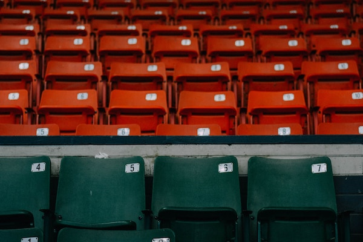
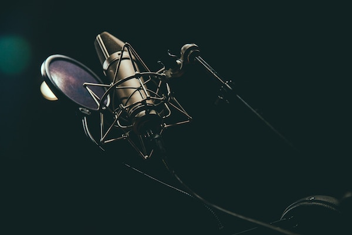

# Hi, I'm Alex.
****

   

## _"Youth is wasted on the young."_ - George Bernard Shaw

My journey begins New York. Born and raised in Queens, I encompass the New York City vibe: work hard and get yours. Or like one of my favorite rappers writes, "Nothing’s equivalent to the New York state of mind."

I am recent graduate of the City University of New York, Hunter College. I majored in Economics and minored in Computer Science and Mathematics. As an undergraduate, I have worked as Community Liasion, intered for a non-governmental organization of the United Nation and a start-up technology company. Currently, I am a Junior Analyst at Blacklight M/A.

I was fortunate I found Data Science/Machine Learning. I was also fortunate I crafted an interdisciplinary that prepared with the technical and theoretical frameworks in data science. Using these skills, I have built my skill set by taking Coursera and Udemy courses in data science. I will be creating a review on these courses so stay tuned! Moreover, these courses have helped me tackle side projects on finance, socioeconomic, human behavior, and really anything that captures my attention.

****
<h2 style="text-align: center;" markdown="1">Baseball</h2>

 

I have been a fan since 5.
 
I do not know where the passion stems from since I have a Latino background.
 
Wherever this passion emerged from, I am fortunate I found "baseball."
 
I am a New Yorker and from Queens, so by proximity, I am a huge Mets fans.
 
I cried in 2007, 2008, and 2015 (I am only 22, so I do not recall 2000). 

<h2 style="text-align: center;" markdown="1">Hip Hop</h2>

 

Again, I was not raised with hip-hop in my household.
 
But at 13, I discovered Eminem and was hooked ever since.
 
Even though I am fairly young, I do not enjoy much of the trap music.
 
Some of my favorite current rappers are Cole, Kendrick, Joey Bada$$,
 
Mac Miller, Ab-Soul, J.I.D, and CyHi the Prynce.
 
Top 5 Rappers of all-time? (In order) Kendrick, Nas, Eminem, Big L, and J. Cole.  

<h2 style="text-align: center;" markdown="1">Reading</h2>

 
I enjoyed reading but hated that it felt like an obligation because the
 
books were hand-picked by teachers. But I must say,
 
I had to mature before fully understanding some of these books.
 
Ever since college, I read every day for at least 35 minutes.
 
It has helped me grow and dissect information from professionals.
 
Here's a link to my <a href="https://www.instagram.com/booktheories/">Instagram on books I read</a>

