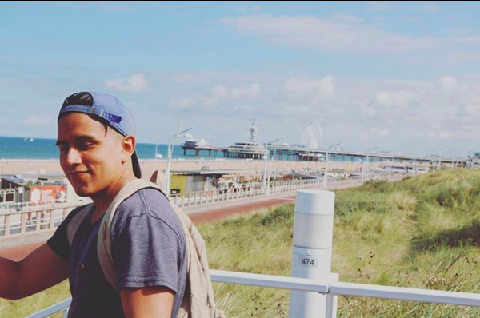
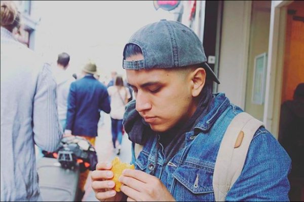
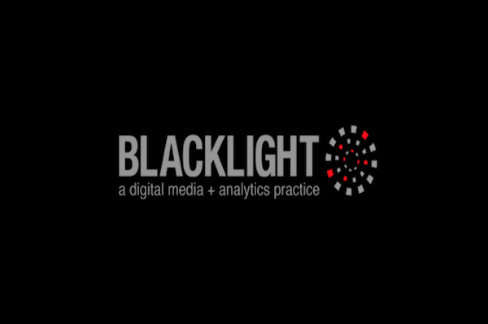
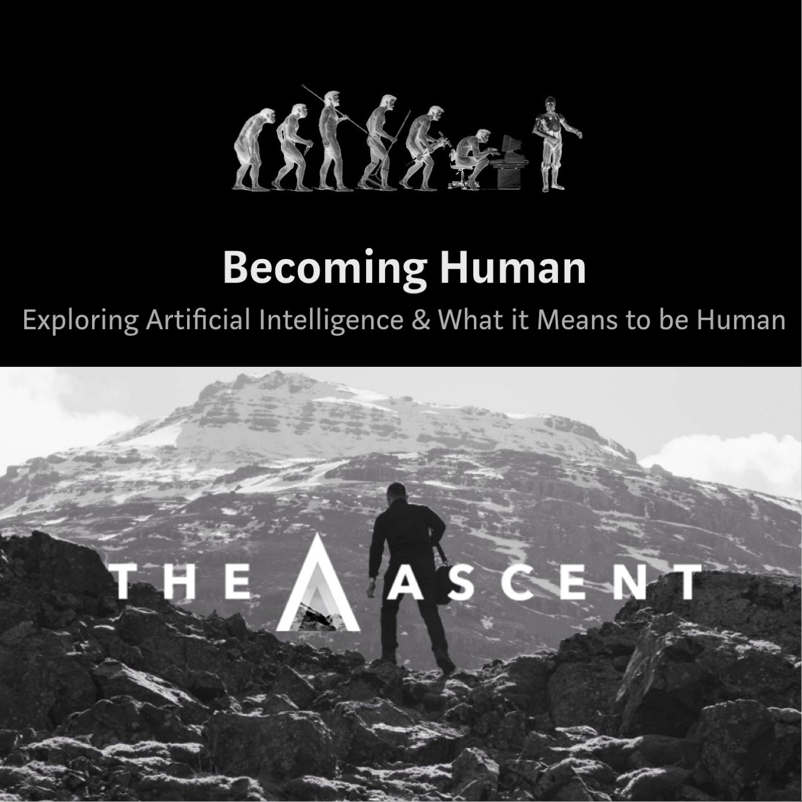

# Hi, I'm Alex.
****

   

## _"Youth is wasted on the young."_ - George Bernard Shaw

Who am I?
- Well, it's not too complicated. The majority of the time I spend looking at data. It could either be analyzing, structuring, or cleaning data. Besides data, I'm also a big hip-hop fan, Mets die-hard, and book worm.

Backstory:
- I was not a 5-year-old answering "I want to be a Data Analyst/Data Scientist." Like most normal 5-years-old, I had aspirations to be MLB player. I then had aspirations to be a rapper. I know, I'm bit all over the place. Anyways, in hindsight, my affinity for lyrics and baseball was conveying facts white maintaining an unbiased position. Even when writing my "bars," I coupled my life experience with research and studies to prove my point. And that's why I am not a famous rapper... Who the fucks wants to hear dense "bars."

---

  

### Blacklight/ MA
#### Data Analyst/Tableau Author, January 2018 - Current
After graduation, I've been working in the Digital Media space. At Blacklight/ MA, are a *"digital media and analytics practice engineered to illuminate and scale profitable customer segments resulting in marketing executions that operate ”In the Black”."*

As a 15-person company, our responsibilities vary and thus, we get exposure to different avenues in the digital media space. Currently, I work with the Search and Social team to analyze our performance. I use my analysis to provide recommendation to our clients. I'm also very involved with creating Tableau workbooks. Being heavily involved with Tableau, I still believe data visualization is not appreciated as it should be.

  

### Medium Writer
#### Writer for Becoming Human and The Ascent

I cannot tell you that I am a consistent writer. However, it is something I am working on. I enjoy Medium because it gives people the ability to express their experiences or teach what they know. My goal is to write one piece for either of these publications ([Becoming Human](https://becominghuman.ai/) or [The Ascent](https://theascent.pub/)) per week.

Some of favorite pieces are: [Bias VS Variance](https://becominghuman.ai/machine-learning-bias-vs-variance-641f924e6c57) & [Pomodoro Technique, version 4.u.](https://theascent.pub/pomodoro-technique-version-4-u-bf9c1b62032e)

  

### Hunter College
#### B.A. in Economics with minors in Computer Science & Mathematics, 2013- 2017

Hunter College provided professors and a counselor (Dr.Liggins) who were more than a faculty staff. It was because of the faculty at Hunter College that I learned of data science/machine learning. While Economics is a great disciplinary, it did fall short in the technical skills. My Economics professors suggested I learn Python and R to adapt the technical skills. Together, we build an interdisciplinary with the technical skills (Python and SQL) with a basis on frameworks for Machine Learning (matrices, vectors, and gradients).

During my time at Hunter College, I was exposed to other fields that I did not plan on learning. Topics such American/European history, Women Right, even World Music have shaped how I communicate and embrace people who might have different values.

  

### Other Activities
#### Research Analyst, Community Liaison, Economics Tutor, & Social Media Analyst
During college, I was able to gain skills that would eventually help in post-college. For example, as a Community Liaison at the Queens Library, I learned how to cooperatively work with a team. Moreover, I learned how to operate with people. A lot of work involved children and parents who were not always friendly. Or at Miramom, where the founder, Irina, was driven by her goal to help facilitate parents being a parent but also a desire to work. Moreover, because I had to wear a lot of hats, I have adapted this skills that is essential in a competitive market. Lastly, being a part of the Economics department and Nonviolence Int'll (an organization part of the U.N.), I comprehend that there's a void in communicating information. Thus, I strengthen my ability to communicate the technical and theoretical frameworks in data/research.  
